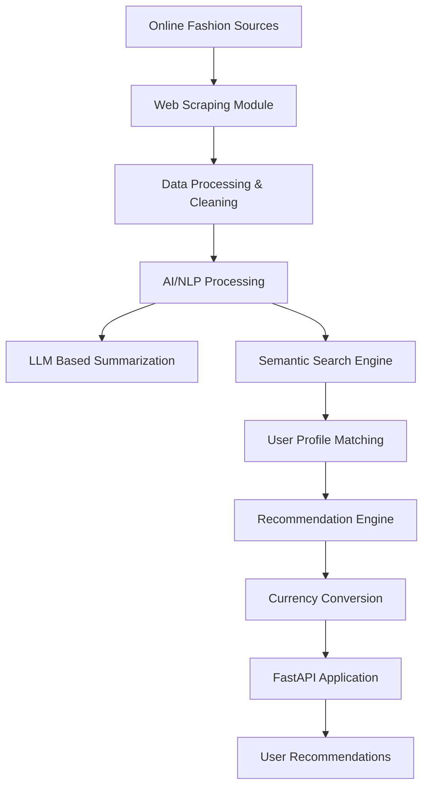

Data-Driven-Fashion-Trend-Aggregator-LLMs
----------------------------------------

The Data-Driven Fashion Trend Aggregator is a FastAPI-based web application designed to
collect, analyze, and recommend fashion trends to users based on their personal profiles. By
integrating web scraping, AI-powered summarization, semantic search, and currency
conversion, the system provides personalized fashion recommendations that adapt to user
preferences, budgets, and occasions


# 👗 Data-Driven Fashion Trend Aggregator using LLMs

<p align="center">


</p>

---

# 📌 Overview

**Data-Driven Fashion Trend Aggregator using LLMs** is an AI-powered fashion intelligence platform built with **FastAPI** that collects, analyzes, and recommends fashion trends based on individual user preferences.

The system combines **web scraping, Large Language Models (LLMs), semantic search, and intelligent recommendation techniques** to deliver personalized fashion insights. Users can discover relevant fashion trends according to their:

* Personal style preferences
* Budget limitations
* Desired occasions
* Current fashion trends
* Regional currency requirements

The platform transforms raw fashion data from online sources into meaningful recommendations using AI-driven analysis and summarization.

---

# ✨ Key Features

## 🕵️ Automated Fashion Data Collection

* Collects fashion-related information from online sources.
* Extracts relevant product and trend information.
* Processes raw web data into structured information.

## 🤖 AI-Powered Trend Summarization

* Uses Large Language Models (LLMs) to analyze fashion content.
* Generates concise summaries of emerging trends.
* Converts complex fashion information into user-friendly insights.

## 🔍 Semantic Search

* Understands user intent beyond simple keyword matching.
* Finds fashion items and trends based on meaning and context.
* Improves recommendation relevance using AI-based retrieval.

## 👤 Personalized Fashion Recommendations

Provides recommendations based on:

* User profile
* Preferred style
* Budget range
* Occasion type
* Fashion interests

## 💱 Currency Conversion

* Supports fashion recommendations across different regions.
* Converts product prices according to user requirements.

## 🚀 FastAPI Backend

* High-performance REST API architecture.
* Easy integration with frontend applications.
* Automatic API documentation support.

---

# 🏗️ System Architecture



---

# 🔄 Application Workflow

```text
                User Profile
                     |
                     ↓
          Preference & Budget Analysis
                     |
                     ↓
        Fashion Data Collection System
                     |
                     ↓
          Data Cleaning & Processing
                     |
                     ↓
       AI Trend Analysis using LLMs
                     |
                     ↓
          Semantic Search & Matching
                     |
                     ↓
        Personalized Recommendation
                     |
                     ↓
          Currency Adjusted Results
```

---

# 🛠️ Technology Stack

| Category                    | Technology                   |
| --------------------------- | ---------------------------- |
| Backend Framework           | FastAPI                      |
| Programming Language        | Python                       |
| Artificial Intelligence     | Large Language Models (LLMs) |
| Natural Language Processing | Semantic Search / NLP        |
| Data Collection             | Web Scraping                 |
| Recommendation System       | AI-based Personalization     |
| Data Processing             | Python Data Libraries        |
| API Documentation           | Swagger / OpenAPI            |

---

# 📂 Project Code Structure

```text
Data-Driven-Fashion-Trend-Aggregator-LLMs/

│
├── app/
│   ├── main.py
│   ├── api/
│   ├── models/
│   ├── services/
│   ├── utils/
│   └── config/
│
├── data/
│
├── requirements.txt
│
├── .env
│
├── README.md
│
└── Project Documentation
```

> Update the structure above according to the final repository folder arrangement.

---

# ⚙️ Local Installation & Setup

## 1. Clone Repository

```bash
git clone https://github.com/SohelRana-aiub-Pro/Data-Driven-Fashion-Trend-Aggregator-LLMs.git
```

Navigate into the project:

```bash
cd Data-Driven-Fashion-Trend-Aggregator-LLMs
```

---

## 2. Create Virtual Environment

### Windows

```bash
python -m venv venv
venv\Scripts\activate
```

### Linux / macOS

```bash
python3 -m venv venv
source venv/bin/activate
```

---

## 3. Install Requirements

```bash
pip install -r requirements.txt
```

---

# 🔐 Environment Configuration

Create a `.env` file in the project root.

Example:

```env
LLM_API_KEY=your_api_key
DATABASE_URL=your_database_url
```

Add required API credentials according to your configuration.

---

# ▶️ Running the Application

Start the FastAPI server:

```bash
uvicorn app.main:app --reload
```

The application will run at:

```
http://127.0.0.1:8000
```

API documentation:

```
http://127.0.0.1:8000/docs
```

---

# 📡 API Capabilities

The system provides APIs for:

| Function                  | Description                        |
| ------------------------- | ---------------------------------- |
| User Profile Management   | Store user preferences             |
| Fashion Trend Retrieval   | Retrieve analyzed trends           |
| Recommendation Generation | Generate personalized suggestions  |
| Semantic Search           | Search fashion items intelligently |
| Currency Conversion       | Convert product prices             |

---

# 🎯 Use Cases

This project can support:

* 👗 Fashion recommendation platforms
* 🛒 E-commerce personalization
* 📊 Fashion market analysis
* 🧵 Designer trend research
* 🌎 International fashion shopping assistants

---

# 🚀 Future Improvements

Possible enhancements:

* Real-time social media trend monitoring
* Image-based fashion recognition
* Virtual stylist assistant
* User feedback learning system
* Mobile application integration
* Advanced recommendation algorithms
* Cloud deployment with scalable infrastructure

---

# 🤝 Contribution

Contributions are welcome.

Steps:

1. Fork the repository.
2. Create a new feature branch.
3. Commit your changes.
4. Push your branch.
5. Submit a Pull Request.

---

# 📜 License

This project is released under the MIT License.

---

# 👨‍💻 Author

**Sohel Rana**

GitHub:
https://github.com/SohelRana-aiub-Pro

---

# ⭐ Support

If this project helped you or inspired your work, consider giving the repository a star ⭐.


For Implement in Local Server/PC , follow the 'Project code structure & Requirements Commands'


Sample Predicted App Outputs;


